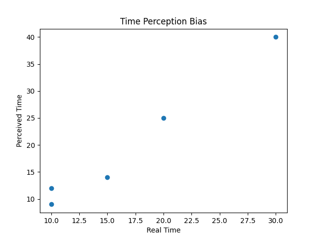

# Time Perception Bias Analysis (Psychology + Data Science)

## 📊 Result

This project shows how humans misjudge time:
- Overestimation under stress
- Underestimation when relaxed

The visualization below highlights this effect.

## Project Overview
This project simulates a psychological experiment on time perception.  
It compares real time with perceived time and analyzes how humans misjudge durations.

---

## What this project does
- Measures the difference between real and perceived time
- Calculates time distortion (bias)
- Computes the average perception error

---

## Psychological Background
Time perception is influenced by cognitive and emotional factors.

- Stress → time feels longer  
- Relaxation → time feels shorter  
- Attention & memory also affect perception  

This project demonstrates these psychological effects using data.

---

## Data Example
| Person | Real Time | Perceived Time |
|--------|----------|----------------|
| A      | 10       | 14             |
| B      | 10       | 8              |
| C      | 10       | 13             |

---

## Technologies Used
- Python
- Pandas

---

## Example Output
Average distortion: 3.2

---

## Why this matters
Understanding time perception is important in:
- Psychology research
- User experience (UX)
- Stress & productivity studies

---

## Future Improvements
- Add visualizations (graphs)
- Use real experimental data
- Compare groups (e.g. stressed vs relaxed)

## Visualization

